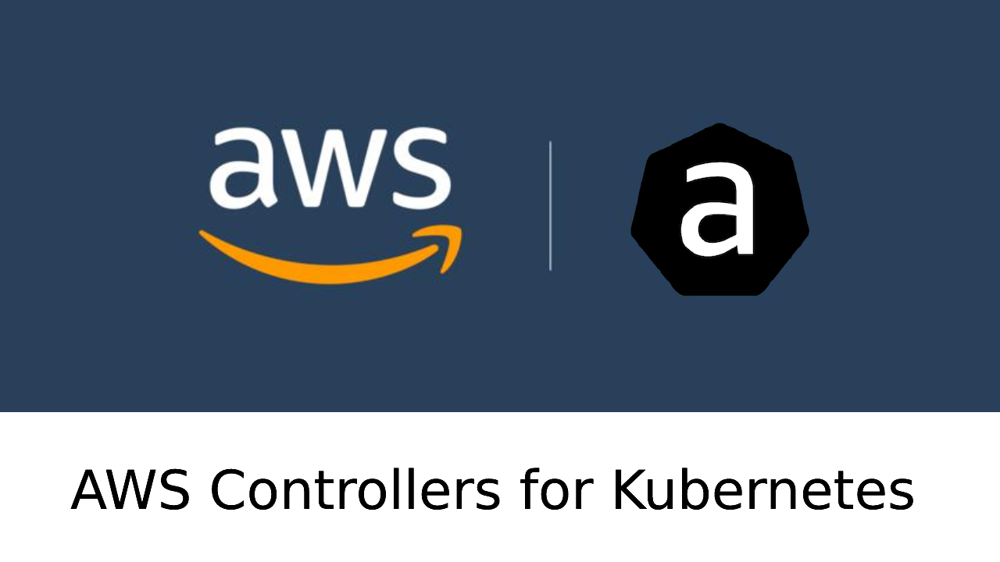
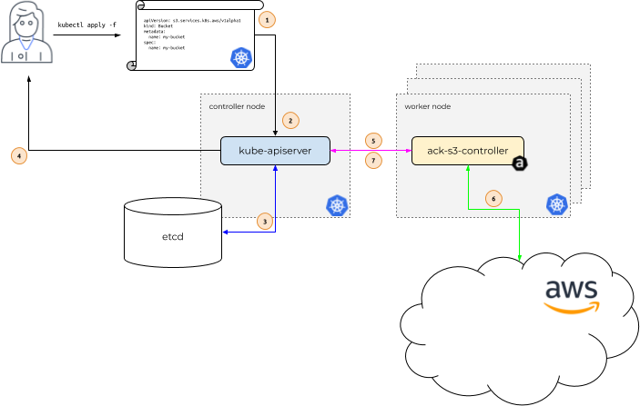
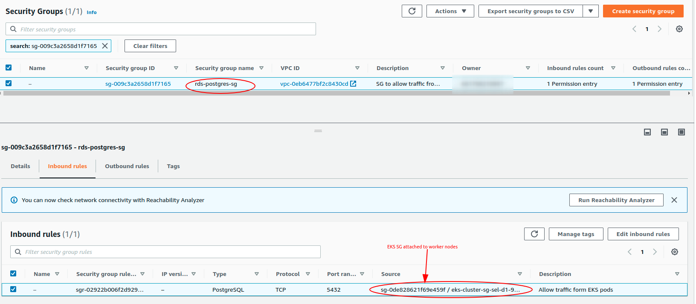
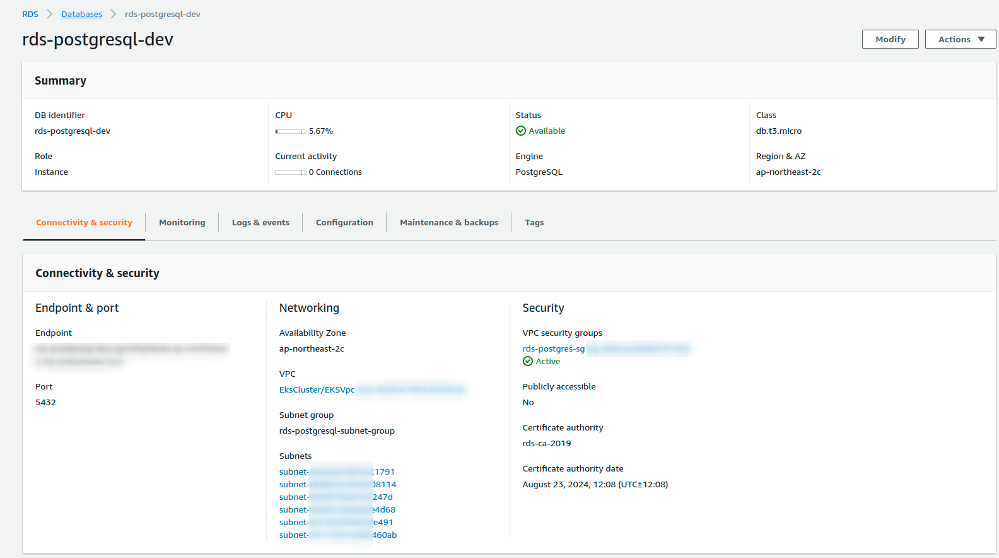

<p align="center">
  <a href="https://dev.to/vumdao">
    
  </a>
</p>
<h1 align="center">
  <div><b>AWS Controllers for Kubernetes Hands-on</b></div>
</h1>

## Abstract
- In the world of Infrastructure as code (IaC) there are many tools support us to create AWS resources quickly such as CDK, Pulumi, Terraform. Today I introduce AWS Controllers for Kubernetes (ACK)
- [AWS Controllers for Kubernetes (ACK)](https://aws-controllers-k8s.github.io/community/docs/community/overview/) lets you define and use AWS service resources directly from Kubernetes. With ACK, you can take advantage of AWS-managed services for your Kubernetes applications without needing to define resources outside of the cluster or run services that provide supporting capabilities like databases or message queues within the cluster.
- This post provides step-by-step to create AWS RDS postgres in private VPC using ACK and then access the database to prove it works.

## Table Of Contents
 * [Introduction of ACK](#Introduction-of-ACK)
 * [Install the ACK service controller for RDS](#Install-the-ACK-service-controller-for-RDS)
 * [Create ACK ServiceAccount base on IRSA](#Create-ACK-ServiceAccount-base-on-IRSA)
 * [Create RDS secret keys](#Create-RDS-secret-keys)
 * [Create subnet group](#Create-subnet-group)
 * [Create security group to allow traffic from EKS pods to the RDS](#Create-security-group-to-allow-traffic-from-EKS-pods-to-the-RDS)
 * [Create DBInstance](#Create-DBInstance)
 * [Access RDS through EKS pod](#Access-RDS-through-EKS-pod)
 * [Clean-up workspace](#Clean-up-workspace)
 * [Conclusion](#Conclusion)

---

## 🚀 **Introduction of ACK** <a name="Introduction-of-ACK"></a>
- [Overview](https://aws-controllers-k8s.github.io/community/docs/community/overview/)
- [How it works](https://aws-controllers-k8s.github.io/community/docs/community/how-it-works/)

  

- [AWS service supported](https://aws-controllers-k8s.github.io/community/docs/community/services/)
- When to use ACK? Read [here](https://dev.to/mda590/trying-out-aws-controllers-for-kubernetes-ack-1897)

## 🚀 **Install the ACK service controller for RDS** <a name="Install-the-ACK-service-controller-for-RDS"></a>
- Pre-requiset:
  - EKS cluster
  - OIDC for IRSA
  - IAM for service account (IRSA) - Checkout [Using IAM Service Account Instead Of Instance Profile For EKS Pods](https://dev.to/vumdao/using-iam-service-account-instead-of-instance-profile-for-eks-pods-262p) for how-to.

- Install ACK for RDS
  ```
  ⚡ $ export HELM_EXPERIMENTAL_OCI=1
  ⚡ $ helm pull oci://public.ecr.aws/aws-controllers-k8s/rds-chart --version=v0.0.17
  ⚡ $ tar xf rds-chart-v0.0.17.tgz
  ⚡ $ helm install rds-chart --generate-name --set=aws.region=ap-northeast-2
  ```

## 🚀 **Create ACK ServiceAccount base on IRSA** <a name="Create-ACK-ServiceAccount-base-on-IRSA"></a>
- This step requires IAM role for service account here is ACK RDS. Note that the role needs permission to manage RDS resource. We can limit permission by restrict resource. And to protect the resource from incident of deleteing the `DBInstance` (describe later), we can set `Deny` action of `rds:DeleteDBInstance`
  ```
  {
      "Version": "2012-10-17",
      "Statement": [
          {
              "Condition": {
                  "StringEquals": {
                      "aws:RequestedRegion": "ap-northeast-2"
                  }
              },
              "Action": "rds:*",
              "Resource": "arn:aws:rds:ap-northeast-2:123456789012:*",
              "Effect": "Allow",
              "Sid": "CreateRds"
          },
          {
              "Action": "rds:DeleteDBInstance",
              "Resource": "*",
              "Effect": "Deny",
              "Sid": "DenyDeleteRds"
          }
      ]
  }
  ```

- Generate SA yaml and update IRSA to apply, replace the IAM ARN role with yours.

  <details>
  <summary>ack-sa.yaml</summary>

  ```
    apiVersion: v1
    kind: ServiceAccount
    metadata:
    labels:
        app.kubernetes.io/component: controller
        app.kubernetes.io/name: ack-rds-controller
    name: ack-rds-controller
    annotations:
        eks.amazonaws.com/role-arn: arn:aws:iam::123456789012:role/ack-rds-controller-d1
  ```

  </details>

- Apply the manifest
  ```
  kf apply -f ack-sa.yaml
  ```

## 🚀 **Create RDS secret keys** <a name="Create-RDS-secret-keys"></a>
- Best practice is to protect the RDS user password
  ```
  export RDS_DB_USERNAME=rds_username
  export RDS_DB_PASSWORD=rds_password

  kubectl create secret generic rds-postgresql-user-creds \
    --from-literal=username="${RDS_DB_USERNAME}" \
    --from-literal=password="${RDS_DB_PASSWORD}"
  ```

## 🚀 **Create subnet group** <a name="Create-subnet-group"></a>
- The subnet group contains all subnet of EKS private VPC
- Get subnets from EKS VPC, replace the VPC ID and the region with yours
  ```
  EKS_SUBNET_IDS=$(aws ec2 describe-subnets --filters "Name=vpc-id,Values=vpc-0eb6477bf2c8430cd" --query 'Subnets[*].SubnetId' --output text --region ap-northeast-2)
  ```

- Generate yaml file inherit ${EKS_SUBNET_IDS} above
  ```
    cat <<-EOF > ack/ack-rds-subnet-groups.yaml
    apiVersion: rds.services.k8s.aws/v1alpha1
    kind: DBSubnetGroup
    metadata:
    name: rds-postgresql-subnet-group
    spec:
    name: rds-postgresql-subnet-group
    description: RDS for app in EKS
    subnetIDs:
    $(printf "    - %s\n" ${EKS_SUBNET_IDS})
    tags:
        - key: stage
          value: development
        - key: owner
          value: dev
    EOF
  ```

- Apply the manifest
  ```
  kf apply -f ack/ack-rds-subnet-groups.yaml
  ```

## 🚀 **Create security group to allow traffic from EKS pods to the RDS** <a name="Create-security-group-to-allow-traffic-from-EKS-pods-to-the-RDS"></a>
- First we create a SG in the EKS VPC to attach to the RDS, replace the VPC ID with your EKS VPC ID and appropriate region
  ```
  RDS_SECURITY_GROUP_ID=$(aws ec2 create-security-group \
         --group-name rds-postgres-sg \
         --description "SG to allow traffic from EKS pod to RDS" \
         --vpc-id vpc-0eb6477bf2c8430cd \
         --output text --region ap-northeast-2
       )
  ```

- Then we need to allow traffic from EKS worker nodes. **There are two ways**
  1. In RDS SG, allow traffic from CIDR range of the EKS VPC
     - Get CIDR range of EKS VCP using command line
       ```
       EKS_CIDR_RANGE=$(aws ec2 describe-vpcs --vpc-ids vpc-0eb6477bf2c8430cd --query 'Vpcs[].CidrBlock' --output text --region ap-northeast-2)
       ```

     - Create ingress in the SG to allow traffic from the above CIDR
        ```
         aws ec2 authorize-security-group-ingress \
         --group-id "${RDS_SECURITY_GROUP_ID}" \
         --protocol tcp \
         --port 5432 \
         --cidr "${EKS_CIDR_RANGE}" \
         --region ap-northeast-2
        ```

  2. In RDS SG, allow traffic from the security group which is attached to all EKS nodes (in general, traffic is allowed from the network interfaces that are associated with the source security group for the specified protocol and port, read more from [Understand Pods communication](https://dev.to/aws-builders/understand-pods-communication-338c) at `Security groups for your VPC` specifying a security group as the source for a rule)

  

## 🚀 **Create DBInstance** <a name="Create-DBInstance"></a>
- Create DBInstance manifest, replace security group ID in `vpcSecurityGroupIDs` with the one you created in previous step `RDS_SECURITY_GROUP_ID`. Here we select RDS instance type `db.t3.micro` as it is free tier, master user and password maps with the RDS secret keys created in previous step, `engine: postgres` version 10
  <details>
  <summary>ack/ack-rds-postgresql.yaml</summary>

  ```
  apiVersion: rds.services.k8s.aws/v1alpha1
  kind: DBInstance
  metadata:
    name: "rds-postgresql-dev"
  spec:
    allocatedStorage: 20
    autoMinorVersionUpgrade: true
    backupRetentionPeriod: 7
    dbInstanceClass: db.t3.micro
    dbInstanceIdentifier: "rds-postgresql-dev"
    dbSubnetGroupName: rds-postgresql-subnet-group
    engine: postgres
    engineVersion: "10"
    masterUsername: "rds_user"
    masterUserPassword:
      namespace: default
      name: rds-postgresql-user-creds
      key: password
    multiAZ: true
    publiclyAccessible: false
    storageEncrypted: true
    storageType: gp2
    vpcSecurityGroupIDs:
      - sg-009c3a2658d1f7165
    tags:
      - key: stage
        value: development
      - key: owner
        value: dev
  ```

  </details>

- Apply the yaml
  ```
  kf apply -f ack/ack-rds-postgresql.yaml
  ```

- Check created `DBInstance`
  ```
  ⚡ $ kf get DBInstance
  NAME                 AGE
  rds-postgresql-dev   1h
  ```

  

## 🚀 **Access RDS through EKS pod** <a name="Access-RDS-through-EKS-pod"></a>
- This step proves RDS works well and EKS pods in private VPC can read/write to the RDS use master user
- Build `postgresql-client` docker image and push it to ECR or any container image repository
  ```
  FROM alpine:3
  RUN apk add --no-cache postgresql-client
  CMD while true; do sleep 5; echo psql-client; done
  ```

- Create postgresql client deployment
  <details>
  <summary>psql-client.yaml</summary>

  ```
  apiVersion: apps/v1
  kind: Deployment
  metadata:
    labels:
      app: psql-client
    name: psql-client
  spec:
    replicas: 1
    selector:
      matchLabels:
        app: psql-client-deployment
    template:
      metadata:
        labels:
          app: psql-client-deployment
      spec:
        containers:
          - image: 123456789012.dkr.ecr.ap-northeast-2.amazonaws.com/psql/client:latest
            name: psql-client
  ```

  </details>

- Apply the deployment and then get pod
  ```
  ~ $ kf apply -f ack/psql-client.yaml
  deployment.apps/psql-client created

  ~ $ kf get pod
  NAME                                    READY   STATUS    RESTARTS   AGE
  psql-client-9d45f759-8swtr              1/1     Running   0          44m
  ```

- Go into the pod to access RDS, get RDS private endpoint in the console or using AWS CLI or using `kubectl`
  ```
  ~ $ aws rds describe-db-instances --db-instance-identifier rds-postgresql-dev --region ap-northeast-2 --query 'DBInstances[0].Endpoint.Address'
  "rds-postgresql-dev.xxxxxxxxxxxx.ap-northeast-2.rds.amazonaws.com"

  ~ $ kubectl get dbinstance rds-postgresql-dev -o jsonpath='{.status.endpoint.address}'
  "rds-postgresql-dev.xxxxxxxxxxxx.ap-northeast-2.rds.amazonaws.com"

  ~ $ kf exec -it psql-client-9d45f759-8swtr -- sh
  / # psql -h rds-postgresql-dev.xxxxxxxxxxxx.ap-northeast-2.rds.amazonaws.com -U rds_user -d postgres
  postgres=> \du
                                                                    List of roles
        Role name      |                         Attributes                         |                          Member of
    --------------------+------------------------------------------------------------+-------------------------------------------------------------
    rds_user           | Create role, Create DB                                    +| {rds_superuser}
                       | Password valid until infinity                              |
    rds_ad             | Cannot login                                               | {}
    rds_iam            | Cannot login                                               | {}
    rds_password       | Cannot login                                               | {}
    rds_replication    | Cannot login                                               | {}
    rds_superuser      | Cannot login                                               | {pg_monitor,pg_signal_backend,rds_replication,rds_password}
    rdsadmin           | Superuser, Create role, Create DB, Replication, Bypass RLS+| {}
                        | Password valid until infinity                              |
    rdsrepladmin       | No inheritance, Cannot login, Replication                  | {}

  postgres=> CREATE DATABASE "rds-test";
  CREATE DATABASE

  postgres=> \l rds-test
                                      List of databases
    Name   |       Owner        | Encoding |   Collate   |    Ctype    | Access privileges
  ----------+--------------------+----------+-------------+-------------+-------------------
  rds-test | rds_user | UTF8     | en_US.UTF-8 | en_US.UTF-8 |
  (1 row)
  ```

## 🚀 **Clean-up workspace** <a name="Clean-up-workspace"></a>
- Delete `DBInstance`, note that if you deny `rds:DeleteDBInstance` in ACK role to protect your RDS then this step requires more action such as remove the deny or delete RDS manually then force delete `DBInstance`. Here assume ACK RDS role has permission of deleting the RDS
  ```
  ⚡ $ kf delete DBInstance rds-postgresql-dev
  dbinstance.rds.services.k8s.aws "rds-postgresql-dev" deleted
  ```

- Delete `psql-client` deployment
  ```
  ⚡ $ kf delete -f ack/psql-client.yaml
  deployment.apps "psql-client" deleted
  ```

- Delete RDS secret key
  ```
  ⚡ $ kf delete secret rds-postgresql-user-creds
  secret "rds-postgresql-user-creds" deleted
  ```

- Delete RDS security group
  ```
  ⚡ $ aws ec2 delete-security-group --group-id sg-009c3a2658d1f7165 --region ap-northeast-2
  ```

- Uninstall ACK RDS
  ```
  ⚡ $ helm list
  NAME                    NAMESPACE       REVISION        UPDATED                                 STATUS          CHART                   APP VERSION
  rds-chart-1648053478    default         1               2022-03-23 23:38:11.397906502 +0700 +07 deployed        rds-chart-v0.0.17       v0.0.17

  ⚡ $ helm uninstall rds-chart-1648053478
  release "rds-chart-1648053478" uninstalled
  ```

- Finally delete the IRSA for ACK RDS
  ```
  ⚡ $ cdk destroy AckControllerSA --profile vc-mfa
  Are you sure you want to delete: AckControllerSA (y/n)? y
  AckControllerSA: destroying...

  ✅  AckControllerSA: destroyed
  ```

## 🚀 **Conclusion** <a name="Conclusion"></a>
- Using ACK to create AWS resources is a big plus for those ones love managing AWS resources through k8s manifests within the EKS cluster
- We can combine cdk8s to crea

---

References:
- [Deploy Amazon RDS databases for applications in Kubernetes](https://aws.amazon.com/blogs/database/deploy-amazon-rds-databases-for-applications-in-kubernetes/)


---

<h3 align="center">
  <a href="https://dev.to/vumdao">:stars: Blog</a>
  <span> · </span>
  <a href="https://github.com/vumdao/aws-ack-handson/">Github</a>
  <span> · </span>
  <a href="https://stackoverflow.com/users/11430272/vumdao">stackoverflow</a>
  <span> · </span>
  <a href="https://www.linkedin.com/in/vu-dao-9280ab43/">Linkedin</a>
  <span> · </span>
  <a href="https://www.linkedin.com/groups/12488649/">Group</a>
  <span> · </span>
  <a href="https://www.facebook.com/CloudOpz-104917804863956">Page</a>
  <span> · </span>
  <a href="https://twitter.com/VuDao81124667">Twitter :stars:</a>
</h3>
